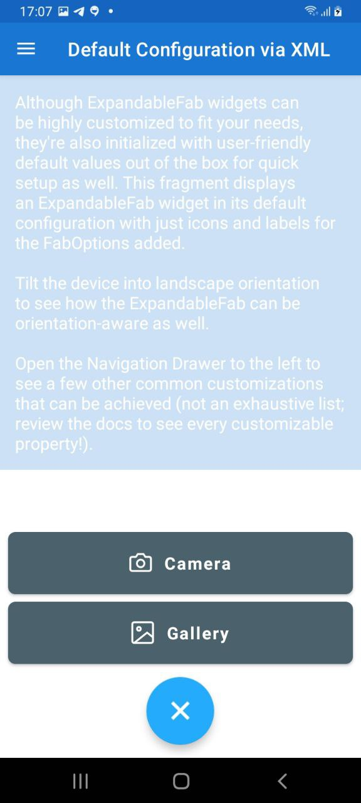

# ExpandableFab
[](https://search.maven.org/artifact/com.nambimobile.widgets/expandable-fab)
[](/library/build.gradle)
[](LICENSE.txt)

[](https://nambicompany.github.io/expandable-fab/)
[](http://www.nambi.io)

A highly customizable Android widget that displays the available actions of a UI via an expandable set of floating action buttons - with optional labels and fluid animations.

Designed to be screen orientation aware, so it can display different elements from portrait to landscape.

Custom FAB Preview


## Examples
A working Android app filled with some common use cases and customizations of the ExpandableFab widget can be found and built under [examples](/examples). Below are a few gifs of the widget in use (this isn't an exhaustive list - the ExpandableFab can do so much more!).


## Usage
Consider reading our Medium articles on [what the ExpandableFab is](https://uxdesign.cc/a-modern-take-on-the-expandable-floating-action-button-for-android-aka-speed-dial-4146e63c658c) and [how to use it](https://uxdesign.cc/how-to-use-the-expandable-floating-action-button-9c6fdedc4169) if you prefer a more in-depth walkthrough.

Otherwise, simply include the ExpandableFab widget in your project via Gradle (replace X.X.X with the latest version shown here [](https://search.maven.org/artifact/com.nambimobile.widgets/expandable-fab)):

```groovy
implementation 'com.nambimobile.widgets:expandable-fab:X.X.X'
```

or Maven:

```xml
<dependency>
  <groupId>com.nambimobile.widgets</groupId>
  <artifactId>expandable-fab</artifactId>
  <version>X.X.X</version>
  <type>aar</type>
</dependency>
```

Then easily add some of the ExpandableFab widget views to your layout like so:

```xml
<!-- This is NOT a root view, but should be a child of whatever root view you choose (CoordinatorLayout, ConstraintLayout, etc) -->
<com.nambimobile.widgets.efab.ExpandableFabLayout
  android:layout_width="match_parent"
  android:layout_height="match_parent">
  
  <!-- The next 3 Views will only display in portrait orientation -->          
  <com.nambimobile.widgets.efab.Overlay
    android:layout_width="match_parent"
    android:layout_height="match_parent"
    app:overlay_orientation="portrait"/>
  <com.nambimobile.widgets.efab.ExpandableFab
    android:layout_width="wrap_content"
    android:layout_height="wrap_content"
    android:layout_gravity="bottom|end"
    android:layout_marginBottom="@dimen/ui_margin_medium"
    android:layout_marginEnd="@dimen/ui_margin_medium"
    android:layout_marginRight="@dimen/ui_margin_medium"
    app:efab_orientation="portrait"/>
  <com.nambimobile.widgets.efab.FabOption
    android:layout_width="wrap_content"
    android:layout_height="wrap_content"
    app:fab_orientation="portrait"
    app:label_text="Portrait Option 1"
    android:onClick="onClickPortraitOption1"/>

  <!-- The next 3 Views will only display in landscape orientation -->
  <com.nambimobile.widgets.efab.Overlay
    android:layout_width="match_parent"
    android:layout_height="match_parent"
    app:overlay_orientation="landscape"/>
  <com.nambimobile.widgets.efab.ExpandableFab
    android:layout_width="wrap_content"
    android:layout_height="wrap_content"
    android:layout_gravity="bottom|end"
    android:layout_marginBottom="@dimen/ui_margin_medium"
    android:layout_marginEnd="@dimen/ui_margin_medium"
    android:layout_marginRight="@dimen/ui_margin_medium"
    app:efab_orientation="landscape"/>
  <com.nambimobile.widgets.efab.FabOption
    android:layout_width="wrap_content"
    android:layout_height="wrap_content"
    app:fab_orientation="landscape"
    app:label_text="Landscape Option 1"
    android:onClick="onClickLandscapeOption1"/>
            
</com.nambimobile.widgets.efab.ExpandableFabLayout>
```

### Usage Notes
* Make sure to include the `xmlns:app="http://schemas.android.com/apk/res-auto` namespace in each layout file that uses the ExpandableFab widget in order to have access to custom properties.
* Setting ExpandableFabLayout's width and height to match_parent will not impede the viewability, clickability or focusability of any other views in your layout (and is needed for children like `Overlay` who may need the ability to use the full screen).
* Defining separate widgets for portrait and landscape orientations is not necessary and was done above simply to showcase the widget's orientation awareness. By default, if you only define one widget, it will automatically be used for both portrait and landscape orientations.
* Every property in every View within the ExpandableFab widget can be accessed or set programmatically *and* via XML layout files.
* None of the customizable properties for the widget Views were set in the example above, so they will all assume their default values automatically.
    * See the [library website](https://nambicompany.github.io/expandable-fab/) for a full list of every customizable property for each View, the full Kotlin/Java Docs and many more helpful notes and tips on using the ExpandableFab.


## ChangeLog
Please see [CHANGELOG.md](/CHANGELOG.md) for a complete account of all changes in each release of this library.


## Contributing
Please see [CONTRIBUTING.md](/CONTRIBUTING.md) for information about contributing to this library.


## License
```
MIT License

Copyright (c) 2020 Kelvin Abumere and The Nambi Company

Permission is hereby granted, free of charge, to any person obtaining a copy
of this software and associated documentation files (the "Software"), to deal
in the Software without restriction, including without limitation the rights
to use, copy, modify, merge, publish, distribute, sublicense, and/or sell
copies of the Software, and to permit persons to whom the Software is
furnished to do so, subject to the following conditions:

The above copyright notice and this permission notice shall be included in all
copies or substantial portions of the Software.

THE SOFTWARE IS PROVIDED "AS IS", WITHOUT WARRANTY OF ANY KIND, EXPRESS OR
IMPLIED, INCLUDING BUT NOT LIMITED TO THE WARRANTIES OF MERCHANTABILITY,
FITNESS FOR A PARTICULAR PURPOSE AND NONINFRINGEMENT. IN NO EVENT SHALL THE
AUTHORS OR COPYRIGHT HOLDERS BE LIABLE FOR ANY CLAIM, DAMAGES OR OTHER
LIABILITY, WHETHER IN AN ACTION OF CONTRACT, TORT OR OTHERWISE, ARISING FROM,
OUT OF OR IN CONNECTION WITH THE SOFTWARE OR THE USE OR OTHER DEALINGS IN THE
SOFTWARE.
```